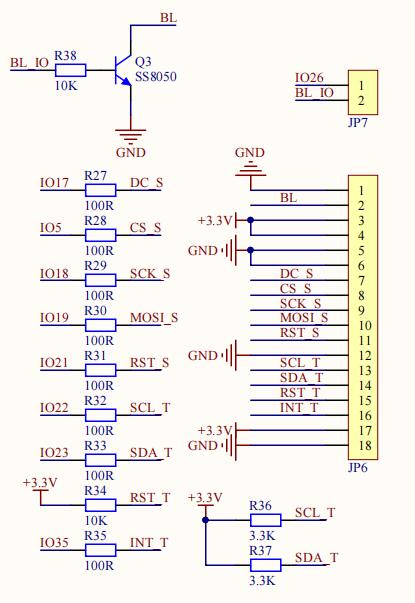
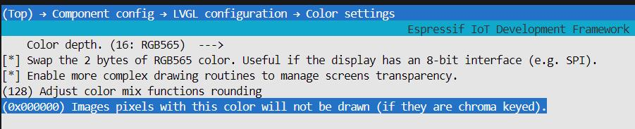

## **#smartWatch**

### overview

Based on ESP32 board and devloped on ESP-IDF 5.2.3 frame.

### Demostrate

link: `https://www.bilibili.com/video/BV1d8AzeiEC7/?share_source=copy_web&vd_source=9764d86014ed77e2a1a93a3e0336772e`

### How to get source code

Enter the following command into the git terminal

 `git clone --recursive https://github.com/strae2001/smartWatch.git`

### Precondition

1. Before building this project,  you must install the ESP-IDF framework(preferably version 5.2.3) on vscode.
2. **Hardware**:  esp32 board、MicroSDcard slot of the SPI interface（CMD line need 10k pullup）、MicroSDcard、*I.69IPS* Touch screen for SPI and I2C interfaces（st7789、cst816t）

​		**Wiring diagram**

​		**SDcard slot**

| SD card pin | SPI pin | ESP32 pin     |
| ----------- | ------- | ------------- |
| D0          | MISO    | GPIO4         |
| D3          | CS      | GPIO13 (MTCK) |
| CLK         | SCK     | GPIO14 (MTMS) |
| CMD         | MOSI    | GPIO15 (MTDO) |

​		**LCD**

### How to build project? 

1. Open smartWatch file by vscode  and open the esp-IDF terminal

   Enter the following command in order:  

   `cd .\components\lvgl\`

   `git checkout v8.3.10`

   `cd ..\..`

3. build project, Enter the following command in order: 

   `idf.py fullclean`

   `idf.py build`

4. flash to your esp32 board

   `idf.py flash monitor`

### Problem

If your screen color displays a color difference and the image has a black square in the background 

then Enter the following command:

`idf.py menuconfig`

After the configuration page is displayed, perform the following configurations：

